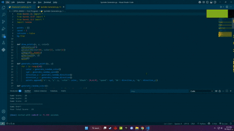

# Sprinkle Generator 🎨✨

A **Python OpenGL** project that generates colorful animated "sprinkles" on the screen when the user interacts via mouse clicks. This interactive visualization allows real-time control over sprinkle generation, speed, and display mode, making it a fun yet educational project for learning **computer graphics** with **PyOpenGL**.


## 📌 Overview

The *Sprinkle Generator* creates animated points (“sprinkles”) that move in random directions and colors when you click the right mouse button. You can adjust their speed, toggle between colorful and monochrome display modes, and watch them scatter dynamically.

This project demonstrates:

* Point rendering in **OpenGL**
* Handling mouse and keyboard inputs in GLUT
* Real-time animation and rendering
* Randomized colors, speeds, and directions


## 🛠 Features & Functionality

### 1. **Sprinkle Generation**

* **Right Mouse Click:** Generates **10 random sprinkles** at the clicked position.
* Each sprinkle has:

  * Random color
  * Random movement speed
  * Random direction (X and Y axes)

### 2. **Speed Control**

* **Arrow Up (↑):** Increases movement speed.
* **Arrow Down (↓):** Decreases movement speed.

### 3. **Background Toggle**

* **Left Mouse Click:** Switch between:

  * **Color mode** — sprinkles keep their random colors
  * **Monochrome mode** — sprinkles turn black

### 4. **Animation**

* Sprinkles move continuously across the screen according to their assigned direction and speed.
* Real-time frame updates using `glutIdleFunc`.


## 📐 Technical Details

* **Language:** Python 3
* **Libraries:**

  * `PyOpenGL` (OpenGL.GL, OpenGL.GLUT, OpenGL.GLU)
  * `random`
* **Window Size:** 500×500 pixels
* **Projection:** Orthographic (`glOrtho`)


## 🎯 Controls

| Action             | Input                 |
| ------------------ | --------------------- |
| Generate Sprinkles | **Right Mouse Click** |
| Toggle Color/Black | **Left Mouse Click**  |
| Increase Speed     | **Arrow Up**          |
| Decrease Speed     | **Arrow Down**        |


## 🖼 Image Preview

*(Add your screenshots or GIFs here)*

Example:





## 📥 Installation & Usage

### 1️⃣ Install Python

Make sure you have **Python 3.8+** installed.
[Download Python](https://www.python.org/downloads/)

### 2️⃣ Install Dependencies

```bash
pip install PyOpenGL PyOpenGL_accelerate
```

### 3️⃣ Download the Project

```bash
git clone https://github.com/<your-username>/sprinkle-generator.git
cd sprinkle-generator
```

### 4️⃣ Run the Program

```bash
python "Sprinkle Generator.py"
```


## 📌 Future Improvements

* Add gravity or bouncing effect for sprinkles.
* Implement a fade-out effect for old sprinkles.
* Support custom sprinkle shapes.


## 👨‍💻 Author

**Jaawad Tashick**
*Computer Science Graduate | Graphics & AI Enthusiast*

